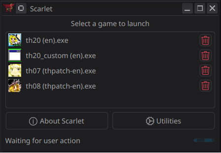
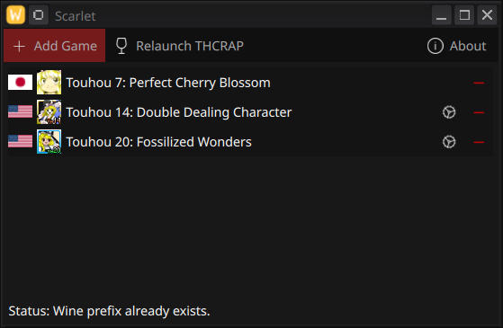

  </img>
  <h1>Scarlet</h1>
  
Graphical QT Linux wrapper around the Touhou Community Reliant Automatic Patcher. 

  <table>
    <td></td>
    <td></td>
  </table>

## Usage

- Build using `./build.sh`

## Credits

- Touhou Patch Center for making thcrap
