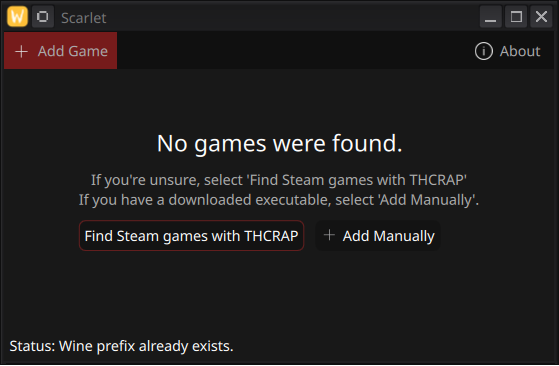

  </img>
  <h1>Scarlet</h1>
  
THCRAP powered launcher for Touhou games for Linux.

  <table>
    <td></td>
    <td></td>
  </table>

## Installation

Installation is handled via `CMake`.
By default `cmake --install build` will install to `/usr/local/bin`.

To install to a different directory, set `-DCMAKE_INSTALL_PREFIX` e.g
`cmake -DCMAKE_INSTALL_PREFIX=/usr --install build`

## Steam Deck?

Flatpak support for the Steam Deck is being looked into, as is controller
support. Until then, you can build the application locally by installing to `~/.local/share/bin` and adding this to `PATH`.

## Requirements

- A C++ compiler (`gcc/g++`) and `cmake`
- QT development libraries, will depend on distro

## Credits

- Touhou Patch Center for making thcrap
- Flags are provided by https://flagpedia.net
